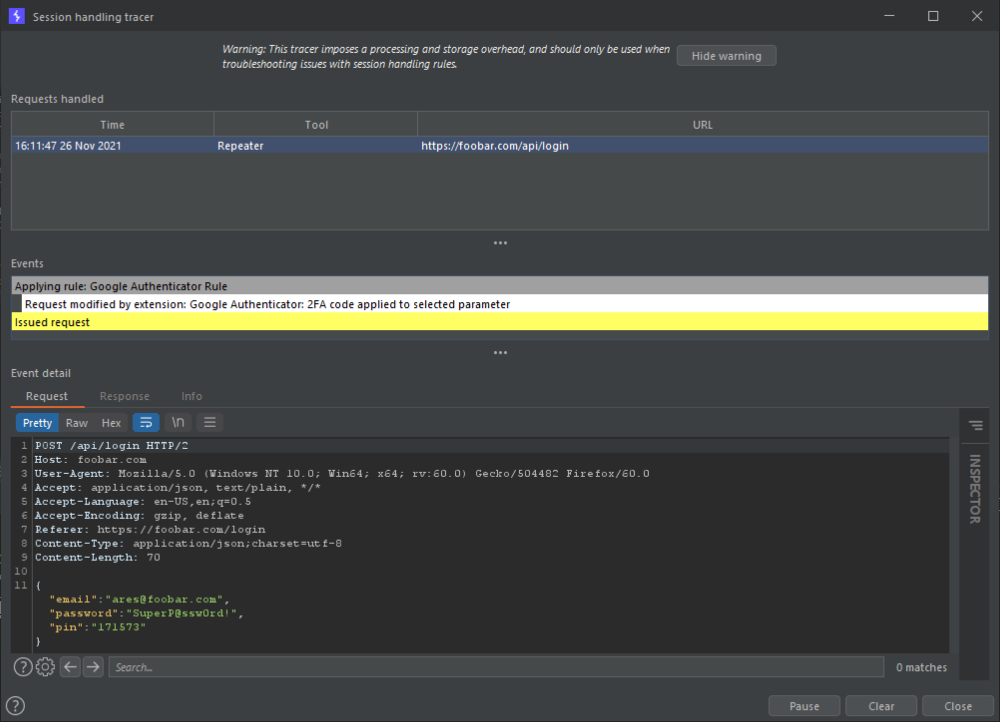

# Google-Authenticator

[](https://www.java.com)
[](https://opensource.org/licenses/Apache-2.0)

## A Burp Suite extension to apply the current Google Two-Tactor Authentication (2FA) code to relevant/selected requests.

This Burp Suite extension turns Burp into a Google Authenticator client. The current Google `Two-Factor Authentication (2FA)` code is automatically computed from a given shared secret and applied to bespoke location(s) in relevant requests in real-time.

Further information on two-factor authentication is available at the following links:

- <https://en.wikipedia.org/wiki/Google_Authenticator>
- <https://tools.ietf.org/html/rfc4226>
- <https://tools.ietf.org/html/rfc6238>

Further information about Burp session handling rules is available at the following link:

- <https://portswigger.net/support/configuring-burp-suites-session-handling-rules>

---

## Graphic User Interface (GUI) overview


- Top panel: Secret shared key, used to generate the Google 2FA code using the `Time-based One-Time Password (TOTP)` algorithm specified in `RFC4226` and `RFC6238`.
- Left panel: Regular expression for the session handling rule to match and replace with the current Google 2FA code.
- Right panel: Google 2FA generated code in real-time.

---

## Example

### Problem

We have been commissioned to perform a web application penetration test on www.foobar.com. This web application implements a login form incorporating Google 2FA for an additional layer of defence (prevents automated attacks such as brute forcing attacks). The client provided us with testing credentials along with a link to set up the Google Authenticator mobile application to allow for authenticated testing.

A login is performed using the following request (in this example, the `pin` JSON parameter is the Google 2FA).

```
POST /api/login HTTP/1.1
Host: foobar.com
User-Agent: Mozilla/5.0 (Windows NT 10.0; Win64; x64; rv:60.0) Gecko/504482 Firefox/60.0
Accept: application/json, text/plain, */*
Accept-Language: en-US,en;q=0.5
Accept-Encoding: gzip, deflate
Referer: https://foobar.com/login
Content-Type: application/json;charset=utf-8
Content-Length: 74
Connection: close

{"email":"ares@foobar.com","password":"SuperP@ssw0rd!","pin":"504482"}
```

Following the aforementioned link, we obtain the shared secret (`42TCJUDP94W27YR3`) that the `Time-based One-time Password Algorithm (TOTP)` uses to generate the Google 2FA codes.

During testing, we observed that the application is being protected by a `Web Application Firewall (WAF)`, logging our test user out each time a malicious payload is detected or if too many requests are sent in a short period of time. This configuration makes it virtually impossible to take advantage of the Burp Suite automated scan capabilities.

### Solution

1. Input relevant parameter(s) into the Google Authenticator interface:

   - Shared secret: `42TCJUDP94W27YR3`
   - Regular expression: `(?<![\w\d])\d{6,8}(?![\w\d])`

2. `Project options` -> `Sessions` -> `Session Handling Rules` -> `Add` a `Session Handling Rule` -> `Invoke a Burp extension` -> `Google Authenticator: 2FA code applied to selected parameter`.

   

3. Configure the relevant scope for the registered session handling rule.

4. Watch/monitor relevant request(s) getting updated with the valid/refreshed Google 2FA code generated by `Google Authenticator` using either `Project options` -> `Sessions` -> `Session Handling Rules` -> `Open session tracer` or the `Logger` tab.

   

## Tips

- Use the regex `(?<![\w\d])\d{6,8}(?![\w\d])` for optimal results as Google 2FA codes are made up of 6 to 8 digits according to the relevant RFCs.
- Restrict the scope of the session handling rule down to the request(s) containing the Google 2FA code only.

---

## Installation

### Compilation

#### Windows & Unix

1. Install and configure [Gradle](https://gradle.org) on your system.
2. Download/clone this repository.

```shell
$ git clone https://github.com/aress31/googleauthenticator
$ cd .\googleauthenticator\
```

3. Create the standalone jar:

```shell
$ gradle fatJar
```

### Loading the extension into the Burp Suite

In Burp Suite, under the `Extender/Options` tab, click on the `Add` button and load the `googleauthenticator-all` jar file located in the `.\build\libs` folder.

Alternatively, you can now directly install/load this extension from the `BApp Store`.

_Note: The version of this extension distributed on the `BApp Store` might be lagging behind the version available on this repository._

---

## Possible Improvements

- [ ] Add additional features, maybe support for Microsoft Authenticator.
- [ ] Beautify the GUI.
- [ ] Implement a JTable to view modified requests in real-time.
- [ ] Leverage the `IHttpListener` interface and rework the filers in order to provide users with more ways of processing request(s).
- [ ] Source code optimisation.

---

## License

Copyright (C) 2018 - 2021 Alexandre Teyar

Licensed under the Apache License, Version 2.0 (the "License");
you may not use this file except in compliance with the License.
You may obtain a copy of the License at

<http://www.apache.org/licenses/LICENSE-2.0>

Unless required by applicable law or agreed to in writing, software
distributed under the License is distributed on an "AS IS" BASIS,
WITHOUT WARRANTIES OR CONDITIONS OF ANY KIND, either express or implied.
See the License for the specific language governing permissions and
limitations under the License.
