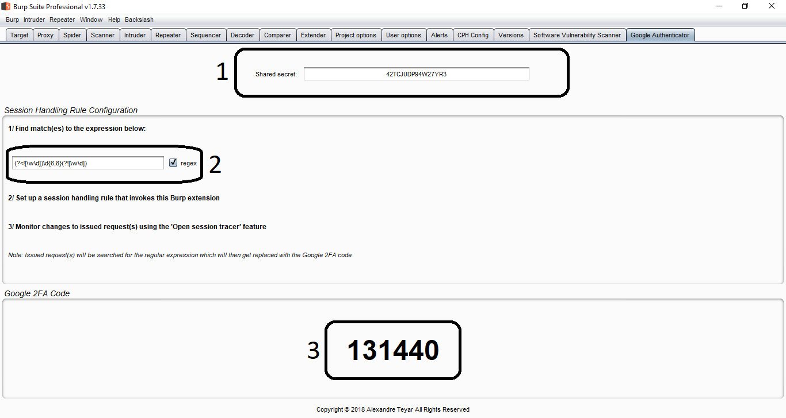
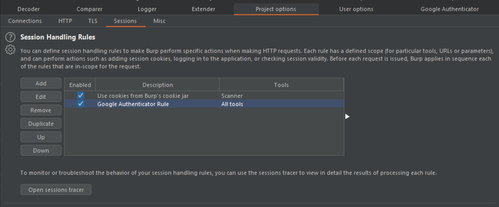

# GoogleAuthenticator
[](https://www.java.com)
[](https://opensource.org/licenses/Apache-2.0)

## A Burp Suite extension to apply the current Google two-factor authentication (2FA) code to relevant requests.
This Burp Suite extension turns Burp into a Google Authenticator client. The current Google 2FA code is automatically applied to bespoke location(s) in relevant requests.

Further information are available at the following links:
<https://en.wikipedia.org/wiki/Google_Authenticator>
<https://tools.ietf.org/html/rfc4226>
<https://tools.ietf.org/html/rfc6238>

## User interface

* Zone 1: Secret shared key, used to generate the Google 2FA code using the TOTP algorithm specified in RFC4226 and RFC6238.
* Zone 2: Regular expression for the session handling rule to match and replace with the current Google 2FA code.
* Zone 3: Google 2FA generated code in real-time.

## Example
### Problem
We are comissioned to perform a web application penetration test on www.foobar.com. This web application implements a login form that uses Google 2FA for an additional layer of defense (prevents automated attacks such as brute forcing attacks). The client provided us with testing credentials along with a link to set up the Google Authenticator mobile application to allow for authenticated tesing.

The following request is being used for login (in this example, the `pin` JSON parameter is the Google 2FA).
```
POST /api/login HTTP/1.1
Host: foobar.com
User-Agent: Mozilla/5.0 (Windows NT 10.0; Win64; x64; rv:60.0) Gecko/504482 Firefox/60.0
Accept: application/json, text/plain, */*
Accept-Language: en-US,en;q=0.5
Accept-Encoding: gzip, deflate
Referer: https://foobar.com/login
Content-Type: application/json;charset=utf-8
Content-Length: 74
Connection: close

{"email":"ares@foobar.com","password":"SuperP@ssw0rd!","pin":"504482"}
```

Following the aforementioned link, we obtain the shared secret (`42TCJUDP94W27YR3`) that the `Time-based One-time Password Algorithm (TOTP)` uses to generate the Google 2FA codes.

During testing, we observe that the application is being protected by a `web application firewall (WAF)`, logging our test user out each time a malicious payload is detected or if too many requests are sent in a short period of time. This configuration makes it impossible to take advantage of the Burp Suite automated scan capabilities.

### Solution
1. Input relevant parameters into the Google Authenticator user interface, namely:
    * Shared secret : `42TCJUDP94W27YR3`
    * Regular expression: `(?<![\w\d])\d{6,8}(?![\w\d])`

2. `Project options` -> `Sessions` -> add a `Session Handling rRle` -> `Invoke a Burp extension` -> `Google Authenticator: 2FA code applied to selected parameter`.


3. Configure the relevant scope for the registered session handling rule.

## Tips
* Use the regex `(?<![\w\d])\d{6,8}(?![\w\d])` for optimal results as Google 2FA codes are made up 6 to 8 digits according to the RFC.
* Restrict the scope of the session handling rule down to the request(s) containing the Google 2FA code only.

## Installation
### Compilation
1. Install gradle (<https://gradle.org/>)
2. Download the repository.
```shell
$ git clone https://github.com/AresS31/GoogleAuthenticator
$ cd .\GoogleAuthenticator\
```
3. Create the jarfile:
```shell
$ gradle fatJar
```

### Burp Suite settings
In the Burp Suite, under the `Extender/Options` tab, click on the `Add` button and load the `GoogleAuthenticator-all` jarfile. 

## Possible Improvements
- [ ] Add IHttpListener to add more ways of processing requests.
- [ ] Add additional features.
- [ ] Improve the UI.
- [ ] Source code optimisation.

## License
Copyright (C) 2018 Alexandre Teyar

Licensed under the Apache License, Version 2.0 (the "License");
you may not use this file except in compliance with the License.
You may obtain a copy of the License at

<http://www.apache.org/licenses/LICENSE-2.0>

Unless required by applicable law or agreed to in writing, software
distributed under the License is distributed on an "AS IS" BASIS,
WITHOUT WARRANTIES OR CONDITIONS OF ANY KIND, either express or implied.
See the License for the specific language governing permissions and
limitations under the License.
